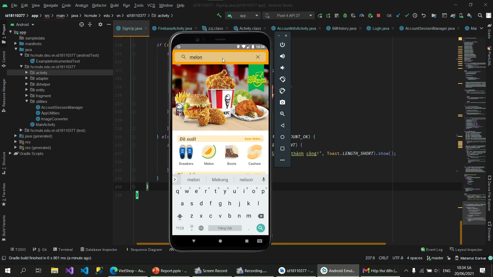

[](https://github.com/TienNHM/VietShop/graphs/contributors)
[](https://github.com/TienNHM/VietShop/issues)


[](https://github.com/TienNHM/VietShop/graphs/code-frequency)

[](https://github.com/TienNHM/VietShop/releases)

## Overview


## Report
### Document
[File report (PDF)](./Report/BaoCao_18110377.pdf)
### Video presentation
<a href="https://drive.google.com/file/d/14kYP4jxZJ2verUmICFSzUm9oQOFPj9YP/view?usp=sharing">
  
</a>


## Project Structure

<details>
  <summary> Chi tiết </summary>


  ``` bash
hcmute.edu.vn.id18110377
│   MainActivity.java
│
├───activity
│       AccountInfoActivity.java
│       AccountSettings.java
│       BillHistory.java
│       CartDetail.java
│       ChangeLanguage.java
│       FirebaseActivity.java
│       ForgotPassword.java
│       Help.java
│       LogIn.java
│       ProductDetail.java
│       SearchResult.java
│       SignUp.java
│
├───adapter
│       BillAdapter.java
│       CartAdapter.java
│       NotificationAdapter.java
│       ProductAdapter.java
│       ProductTypeAdapter.java
│       RecyleItemViewAdapter.java
│
├───dbhelper
│       AccountDbHelper.java
│       BillDbHelper.java
│       CartDbHelper.java
│       DbHelper.java
│       DiscountDbHelper.java
│       NotificationDbHelper.java
│       ProductDbHelper.java
│       ProductImageDbHelper.java
│       ProductTypeDbHelper.java
│       PromoDbHelper.java
│       ReviewDbHelper.java
│       StoreDbHelper.java
│       UserDbHelper.java
│
├───entity
│       Account.java
│       Bill.java
│       Cart.java
│       Discount.java
│       MenuItem.java
│       Notification.java
│       Product.java
│       ProductType.java
│       Promo.java
│       Review.java
│       Store.java
│       User.java
│
├───fragment
│       CartFragment.java
│       DiscountFragment.java
│       HomeFragment.java
│       MenuFragment.java
│       MessageBoxFragment.java
│       NotificationFragment.java
│
└───utilities
        AccountSessionManager.java
        AppUtilities.java
        ImageConverter.java
```

</details>

## Screenshots
[File screenshots (PNG)](./Report/images)
